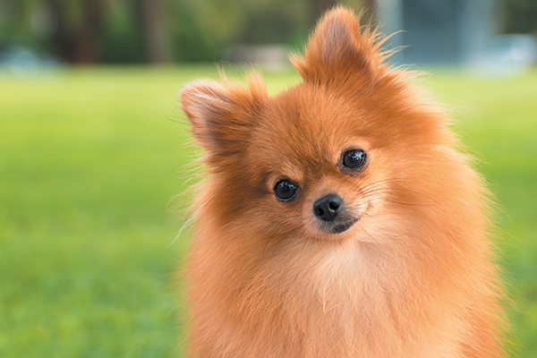

# To jest szpic



## Kilka informacji o szpicach

1. Szpic miniaturowy to inaczej pomeranian
1. Ten mały piesek lubi się popisywać i często z własnej inicjatywy uczy się różnych sztuczek
1. Mieszkając z rodziną łatwo dostosowuje się do zwyczajów panujących w domu i nie sprawia większych kłopotów wychowawczych.
1. Szpic miniaturowy pomeranian jest odporny, źle znosi jedynie upały i silne nasłonecznienie.
1. Bardzo przywiązany do opiekuna, wrażliwy i oddany, nie lubi zostawać na długo sam; najchętniej stale towarzyszyłby właścicielowi.

## Możliwe maści szpica:

- czarny
- brązowy
- biały 
- pomarańczowy
- inne maści: kremowy, kremowo-śniady, łaciaty

| Wady                            |                 Zalety                |   |
|---------------------------------|:-------------------------------------:|--:|
| bywa uparty                     |         nie wymaga dużo ruchu         |   |
| lubi szczekać                   | przystosowuje się do różnych warunków |   |
| nie nadaje się do małych dzieci |           tani w utrzymaniu           |   |

Informacje uzyskane ze stron: [www.psy.pl](https://www.psy.pl/rasa/szpic-miniaturowy-pomeranian/) i [www.psy-pies.com](http://psy-pies.com/artykul/szpic-miniaturowy-pomeranian,69.html)

```{r}
library(ggplot2)

ggplot(data = mpg) + 
  geom_histogram(mapping = aes(displ), binwidth = 0.2 ) +
  labs(title = "Rozkład pojemności silnika samochodów", x = "pojemność silnika", y = "liczba")
```


> To jest cytowanie

```{r message=FALSE, warning=FALSE, include=FALSE}
library(tidyverse)
mpg %>% filter(manufacturer == "audi" , displ > 2) %>% summarise(misto = mean(cty), trasa = mean(hwy))
```

```{r echo=FALSE}
library(tidyverse)
diamonds %>% filter(cut == "Very Good")
  
```


